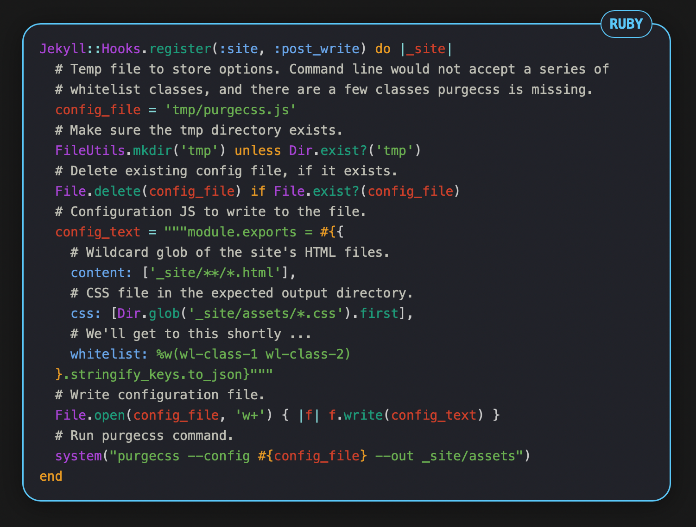

Starlight is a SCSS syntax theme for [Rouge](https://github.com/rouge-ruby/rouge) (Ruby-based code highlighting tool) and is ready for use with Jekyll.

It is the syntax theme I created for my [website](https://victorwynne.com/) and my Jekyll theme [Quattle](https://quattle.victorwynne.com/).

Starlight is free software distributed under a [MIT license](https://github.com/victorwynne/starlight/blob/main/LICENSE).

